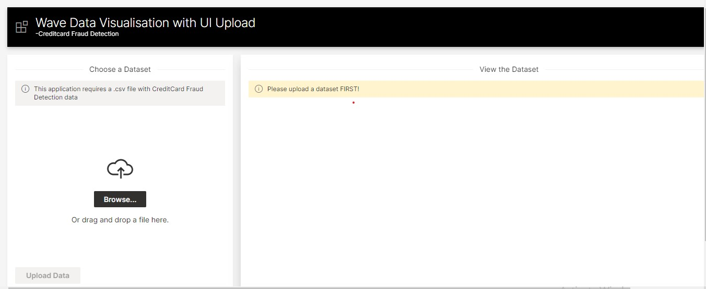
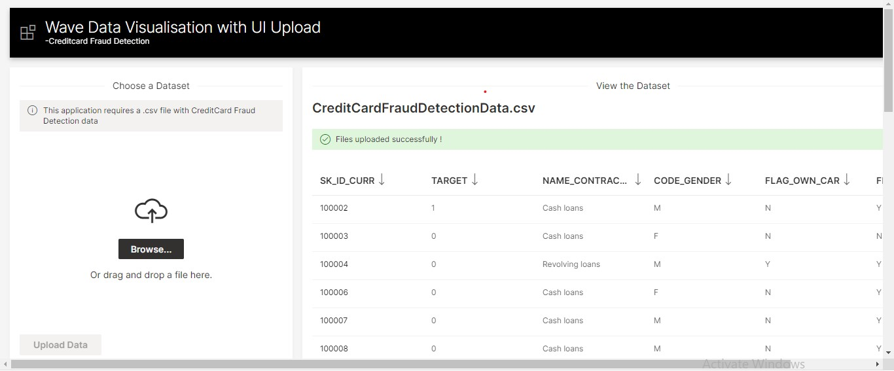
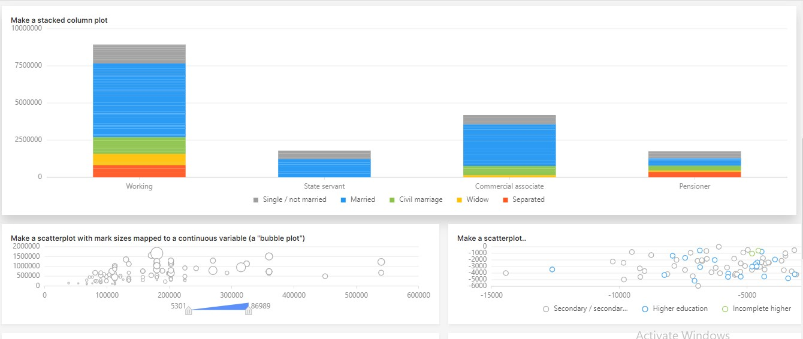
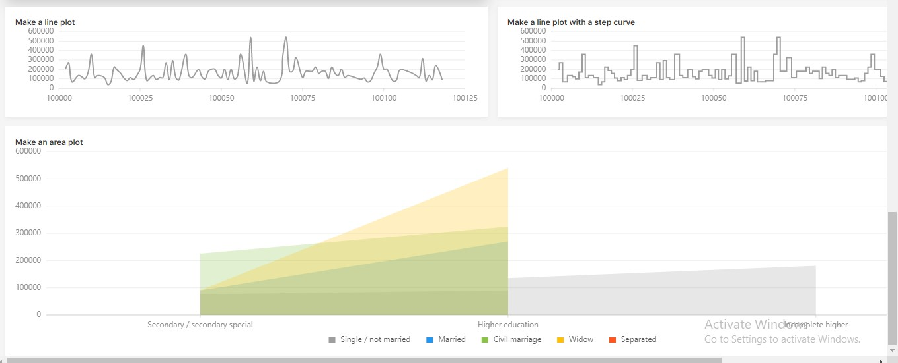
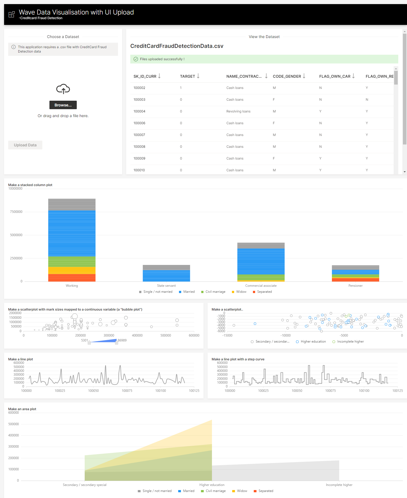

# Data Visualisation -By accepting .csv file from the user using  wave UI/Upload 

This application allows us to  accept the dataset  from the user  in csv format  and visualise data in various ways.
Here I used a subset of dataset available in https://www.kaggle.com/dataislife8/credit-card-fraud-detection-visualizations









## Running this App Locally

### System Requirements

1. Python 3.6+
2. pip3

### 1. Run the Wave Server

New to H2O Wave? We recommend starting in the documentation to [download and run](https://wave.h2o.ai/docs/installation) the Wave Server on your local machine. Once the server is up and running you can easily use any Wave app.

### 2. Setup Your Python Environment

in Windows
```bash
git clone https://github.com/KishaniKandasamy/Data-Visualization-with-upload-download
cd Data-Visualization-with-upload-download
python3 -m venv venv
venv\Scripts\activate.bat
pip install -r requirements.txt
```

### 3. Configure the App
You need to set your WAVE SDK installation path in ```config.py```

### 4. Run the App

```bash
 wave run myapp
```

Note! You need activate your virtual environment this will be:

```bash
venv\Scripts\activate.bat
```

### 5. View the App

Point your favorite web browser to [localhost:10101/myapp](http://localhost:10101/myapp)


